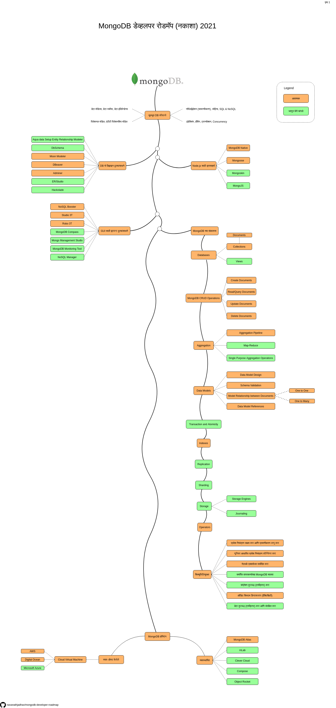

# MongoDB डेव्हलपर रोडमॅप (नकाशा)

या प्रकल्पात सुरवातीपासून MongoDB शिकण्यासाठी रोडमॅपचा समावेश आहे. या रोडमॅपमध्ये MongoDB संबंधित सर्व संभाव्य साधने आणि संकल्पनांचा समावेश केला आहे.
 

प्रेरणास्थान [Angular Developer Roadmap](https://github.com/sulco/angular-developer-roadmap/)

## एक स्टार द्या ⭐
जर आपल्याला हा प्रकल्प आवडला असेल किंवा आपल्याला MongoDB शिकण्यास उपयुक्त वाटले असेल तर कृपया त्यास तारांकित करा. धन्यवाद.

## रोडमॅप

## डाउनलोड करा

मिळवा [PDF version](./mongodb-dev-roadmap-mr.pdf).

## रुपरेषा
1.  मूलभूत DB कौशल्ये
    - डेटा मॉडेल्स, डेटा स्कीमा, डेटा इंडिपेन्डेन्स
    - रिलेशनल मॉडेल, एंटीटी रिलेशनशिप मॉडेल
    - नॉर्मलईझेशन (सामान्यीकरण), जॉईन्स, SQL & NoSQL
    - इंडेक्सिंग, हॅशिंग, ट्रान्सॅक्शन, Concurrency
2.  DB चे डिझाइन टूल्स/साधने
    - [Moon Modeler](https://www.datensen.com/mongodb-design-tool.html)
    - [DBeaver](https://dbeaver.io/)
    - [Adminer](https://www.adminer.org/)
    - [Aqua data Setup Entity Relationship Modeler](https://www.aquafold.com/aquadatastudio/er_modeler)
    - [DbSchema](https://dbschema.com/)
    - [ER/Studio](https://www.idera.com/er-studio-data-architect-software)
    - [Hackolade](https://hackolade.com/)
3.  Node.js साठी ड्रायव्हर्स
    - [MongoDB Native](https://github.com/mongodb/node-mongodb-native)
    - [Mongoose](https://mongoosejs.com/)
    - [Mongoskin](https://www.npmjs.com/package/mongoskin)
    - [MongoJS](https://github.com/mongo-js/mongojs)
4.  GUI साठी क्लायन्ट टूल्स/साधने
    - [NoSQL Booster](https://nosqlbooster.com/)
    - [Studio 3T](https://studio3t.com/)
    - [Robo 3T](https://robomongo.org/)
    - [MongoDB Compass](https://www.mongodb.com/products/compass)
    - [Mongo Management Studio](http://mms.litixsoft.de/)
    - [MongoDB Monitoring Tool](https://www.solarwinds.com/database-performance-monitor/integrations/mongodb-monitoring)
    - [NoSQL Manager](https://www.mongodbmanager.com/)
5.  MongoDB च्या संकल्पना
    - [Databases](https://docs.mongodb.com/manual/core/databases-and-collections/)
      - Collections
      - Views
    - MongoDB CRUD Operations
      - Create Operations
      - Read Operations
      - Update Operations
      - Delete Operations
    - Aggregation
      - [Aggregation Pipeline](https://docs.mongodb.com/manual/aggregation/#aggregation-framework)
      - [Map-Reduce](https://docs.mongodb.com/manual/aggregation/#aggregation-map-reduce)
      - [Single Purpose Aggregation Operations](https://docs.mongodb.com/manual/aggregation/#single-purpose-agg-operations)
    - Data Models
      - Data Model Design
      - Schema Validation
      - Model Relationship between Documents
        - One to One
        - One to Many
      - Data Model References
    - Transaction and Atomicity
    - Indexes
    - Replication
    - [Sharding](https://docs.mongodb.com/manual/reference/glossary/#term-sharding)
    - Storage
    - [Operators](https://docs.mongodb.com/manual/reference/operator/)
      - Query and Projection Operators
      - Update Operators
      - Aggregation Pipeline Stages
      - Aggregation Pipeline Operators
      - Query Modifiers
    - सिक्युरिटी/सुरक्षा
      - प्रवेश नियंत्रण सक्षम करा आणि प्रमाणीकरण लागू करा
      - भूमिका आधारित प्रवेश नियंत्रण कॉन्फिगर करा
      - नेटवर्क एक्सपोजर मर्यादित करा
      - समर्पित वापरकर्त्यासह MongoDB चालवा
      - संप्रेषण कूटबद्ध (एनक्रिप्ट) करा
      - ऑडिट सिस्टम क्रियाकलाप (ऍक्टिव्हिटी)
      - डेटा कूटबद्ध (एनक्रिप्ट) करा आणि संरक्षित करा
6.  MongoDB होस्टिंग
    - स्वतः होस्ट केलेले
      - [AWS](https://aws.amazon.com/)
      - [Digital Ocean](https://www.digitalocean.com/)
      - [Microsoft Azure](https://azure.microsoft.com/en-in/)
    - व्यवस्थापित
      - [MongoDB Atlas](https://www.mongodb.com/cloud/atlas)
      - [mLab](https://mlab.com/)
      - [Clever Cloud](https://www.clever-cloud.com/en/)
      - [Compose](https://www.compose.com/databases/mongodb)
      - [Object Rocket](https://www.objectrocket.com/)

## शेअर करा

हा प्रकल्प उपयुक्त असल्याचे आपल्याला वाटत असल्यास [Twitter](https://twitter.com/intent/tweet?url=https://github.com/navanathjadhav/mongodb-developer-roadmap) वर शेअर करा

## अधिक वाचा
Ever Blogs वर तपशीलवार लेख पहा: [MongoDB Developer Roadmap for 2021 | Ever Blogs](https://everblogs.com/database/mongodb-developer-roadmap-for-2021/)
 
इतर तंत्रज्ञानावरील मनोरंजक ब्लॉग वाचण्यासाठी कृपया [Ever Blogs](https://everblogs.com/) वर भेट द्या.

## योगदान द्या

हा प्रकल्प अधिक विकसित आणि इतर डेव्हलपर्स साठी उपयुक्त बनविण्यात मदत करण्यास आपले नेहमीच स्वागत आहे.

योगदान करण्यासाठी फक्त एक Pull Request सादर करा.

