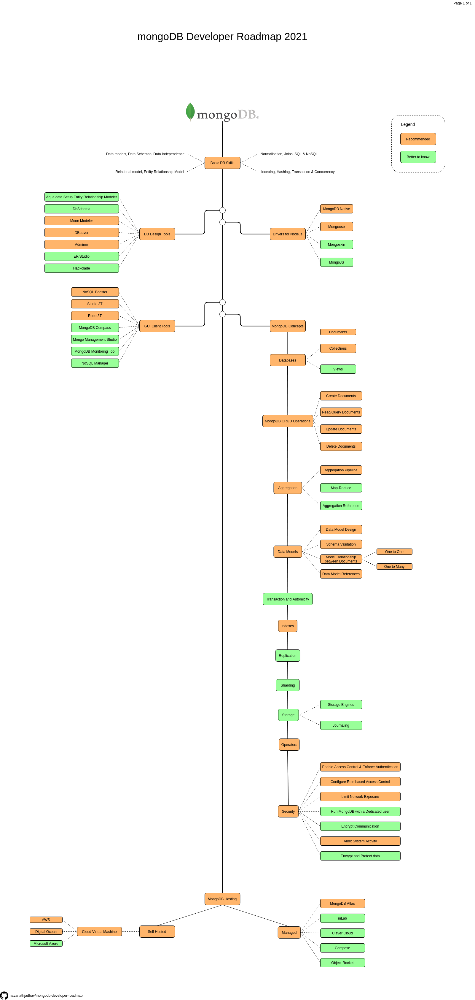

# MongoDB Developer Roadmap

This project includes the roadmap for learning mongoDB from scratch. All possible tools and concepts related to MongoDB has been covered in this roadmap.
 
* Language: [🇮🇳 मराठी](README.MR.md) | [🇬🇧 English](/README.md)

Inspiration from [Angular Developer Roadmap](https://github.com/sulco/angular-developer-roadmap/)

## Give a Star ⭐
If you liked this project or found it helpful for learning MongoDB then please give it a star. It will keep motivating me do more work like this! Thanks.

## Roadmap

## Download

Get a [PDF version](./mongodb-dev-roadmap.pdf).

## Outline
1.  Basic Database Skills
    - Data models, Data Schemas and Data Independence
    - Relational model and Entity-Relationship Model
    - Normalization, Joins, SQL & NoSQL
    - Indexing, Hashing, Transaction & Concurrency
2.  Database Design and its Tools
    - [Moon Modeler](https://www.datensen.com/mongodb-design-tool.html)
    - [DBeaver](https://dbeaver.io/)
    - [Adminer](https://www.adminer.org/)
    - [Aqua data Setup Entity Relationship Modeler](https://www.aquafold.com/aquadatastudio/er_modeler)
    - [DbSchema](https://dbschema.com/)
    - [ER/Studio](https://www.idera.com/er-studio-data-architect-software)
    - [Hackolade](https://hackolade.com/)
3.  Database Drivers
    - [MongoDB Native](https://github.com/mongodb/node-mongodb-native)
    - [Mongoose](https://mongoosejs.com/)
    - [Mongoskin](https://www.npmjs.com/package/mongoskin)
    - [MongoJS](https://github.com/mongo-js/mongojs)
4.  GUI Client Tools
    - [NoSQL Booster](https://nosqlbooster.com/)
    - [Studio 3T](https://studio3t.com/)
    - [Robo 3T](https://robomongo.org/)
    - [MongoDB Compass](https://www.mongodb.com/products/compass)
    - [Mongo Management Studio](http://mms.litixsoft.de/)
    - [MongoDB Monitoring Tool](https://www.solarwinds.com/database-performance-monitor/integrations/mongodb-monitoring)
    - [NoSQL Manager](https://www.mongodbmanager.com/)
5.  MongoDB Concepts
    - [Databases](https://docs.mongodb.com/manual/core/databases-and-collections/)
      - Collections
      - Views
    - MongoDB CRUD Operations
      - Create Operations
      - Read Operations
      - Update Operations
      - Delete Operations
    - Aggregation
      - [Aggregation Pipeline](https://docs.mongodb.com/manual/aggregation/#aggregation-framework)
      - [Map-Reduce](https://docs.mongodb.com/manual/aggregation/#aggregation-map-reduce)
      - [Single Purpose Aggregation Operations](https://docs.mongodb.com/manual/aggregation/#single-purpose-agg-operations)
    - Data Models
      - Data Model Design
      - Schema Validation
      - Model Relationship between Documents
        - One to One
        - One to Many
      - Data Model References
    - Transaction and Atomicity
    - Indexes
    - Replication
    - [Sharding](https://docs.mongodb.com/manual/reference/glossary/#term-sharding)
    - Storage
    - [Operators](https://docs.mongodb.com/manual/reference/operator/)
      - Query and Projection Operators
      - Update Operators
      - Aggregation Pipeline Stages
      - Aggregation Pipeline Operators
      - Query Modifiers
    - Security
      - Enable Access Control & Enforce Authentication
      - Configure Role-Based Access Control
      - Limit Network Exposure
      - Run MongoDB with a Dedicated User
      - Encrypt Communication (TLS/SSL)
      - Audit System Activity
      - Encrypt and Protect Data
6.  MongoDB Hosting
    - Self Hosted
      - [AWS](https://aws.amazon.com/)
      - [Digital Ocean](https://www.digitalocean.com/)
      - [Microsoft Azure](https://azure.microsoft.com/en-in/)
    - Managed Hosting
      - [MongoDB Atlas](https://www.mongodb.com/cloud/atlas)
      - [mLab](https://mlab.com/)
      - [Clever Cloud](https://www.clever-cloud.com/en/)
      - [Compose](https://www.compose.com/databases/mongodb)
      - [Object Rocket](https://www.objectrocket.com/)

## Share & Care

If you think this project is helpful share it on [Twitter](https://twitter.com/intent/tweet?url=https://github.com/navanathjadhav/mongodb-developer-roadmap)

## Read More
View detailed article on Ever Blogs: [MongoDB Developer Roadmap for 2021 | Ever Blogs](https://everblogs.com/database/mongodb-developer-roadmap-for-2021/)
 
Please visit [Ever Blogs](https://everblogs.com/) to read interesting blogs on other Technologies.

## Contribute

You are always welcome to help to make this project more knowledgeable and helpful for other developers.

Just submit a PR.

